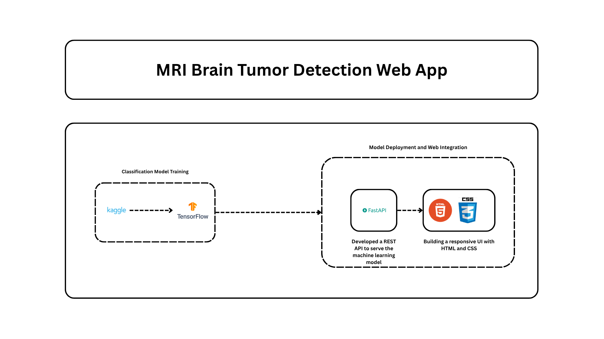

# 🧠 Brain Tumor Detection Web App


An interactive web application built with Python and FastAPI to detect brain tumors from MRI scans using a Convolutional Neural Network (CNN). The interface allows users to upload an image and receive a real-time prediction.

## 📸 Screenshot




## 📂 Project Structure

The repository is organized with a clean and scalable structure, separating logic, models, and presentation layers.
```bash
Tumor_Detection/
├── .gitignore
├── README.md
├── requirements.txt
├── main.py              # FastAPI application entry point
├── models/
│   └── tumor_model.h5   # The trained Keras/TF model
├── static/
│   └── style.css        # CSS for styling the web interface
└── templates/
    └── index.html       # Jinja2 template for the web UI
```
## 🚀 Features

-   **Image Upload:** Supports uploading MRI scan images (`.jpg`, `.png`, `.jpeg`).
-   **Real-Time Prediction:** Instantly classifies whether a tumor is **Detected** or **Not Detected**.
-   **Interactive UI:** Displays the uploaded image alongside the model's prediction result.
-   **Responsive Design:** Ensures a seamless experience on both desktop and mobile devices.

## 🛠️ Tech Stack

-   **Backend:** Python, FastAPI
-   **Machine Learning:** TensorFlow, Keras, Scikit-learn, OpenCV
-   **Frontend:** HTML5, CSS3 (served via Jinja2 templates)
-   **Server:** Uvicorn

## 🏗️ Architecture

This application follows a simple client-server architecture designed for internal communication:

-   **Frontend (Client):** A single HTML page with a form that allows users to upload an image. It is rendered by FastAPI's templating engine.
-   **Backend (Server):** A FastAPI application that serves the frontend and exposes an API endpoint.
-   **API Endpoint (`/predict`):** Acts as the **bridge** between the frontend and the machine learning model. It receives the image from the user's form submission, passes it to the model for inference, and returns the result to be displayed on the same page.

## ⚙️ Setup and Installation

Follow these steps to get the project running on your local machine.

### Prerequisites

-   [Git](https://git-scm.com/)
-   Python 3.10.x

### Installation Steps

1.  **Clone the repository:**
    ```bash
    git clone https://github.com/your-username/Tumor_Detection.git
    cd Tumor_Detection
    ```
    *(Don't forget to replace `your-username` with your actual GitHub username.)*

2.  **Create and activate a virtual environment:**

    -   **For Windows:**
        ```bash
        python -m venv venv
        venv\Scripts\activate
        ```

    -   **For macOS/Linux:**
        ```bash
        python3 -m venv venv
        source venv/bin/activate
        ```

3.  **Install the required dependencies:**
    ```bash
    pip install -r requirements.txt
    ```

## ▶️ Running the Application

1.  **Start the FastAPI server:**
    ```bash
    uvicorn main:app --reload
    ```
    The `--reload` flag automatically restarts the server when you make changes to the code.

2.  **Open your web browser** and navigate to:
    [http://127.0.0.1:8000](http://127.0.0.1:8000)

